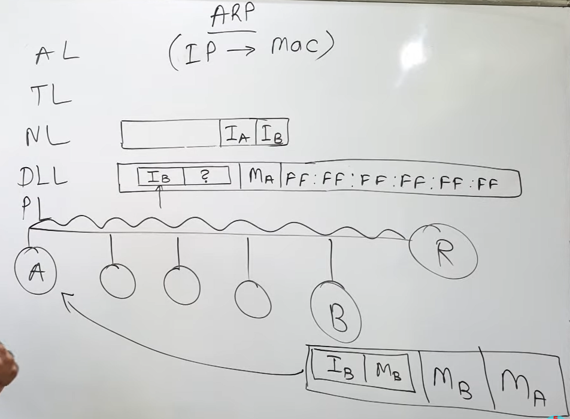

# ARP

---
To map a known IP address to a MAC address in a local network.  
IP addresses operate at network layer, while MAC addresses operate at data link layer.

**HOW ?**  
- Host A broadcasts an ARP Request, Sent to all devices on the LAN.  
- Host B receives the request, recognizes its own IP  
- Then replies with its MAC address directly to Host A (unicast).  
- Host A receives the reply and updates its ARP cache(Temporary memory inside hosts and routers storing IP-to-MAC mappings.).  
- It now sends the data directly to Host B’s MAC address.

---