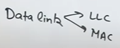

# 
 DATA LINK LAYER

1. **Framing** 
   - Converts raw bits from the physical layer into frames (.
   - Adds header and trailer to identify the beginning and end of a frame.
2. **Error Control**
3. **Flow Control** 
4. **Access Contol**
5. **Physical Addressing** : Adds MAC Address to frames
6. **Node to Node Delivery**

---
#### DESIGN ISSUES
- How to divide data into frames (Framing)?
- How to detect and correct errors (Error Control)?
- How to prevent the receiver from being overloaded (Flow Control)?
- How to control who sends data when the medium is shared (MAC)?

