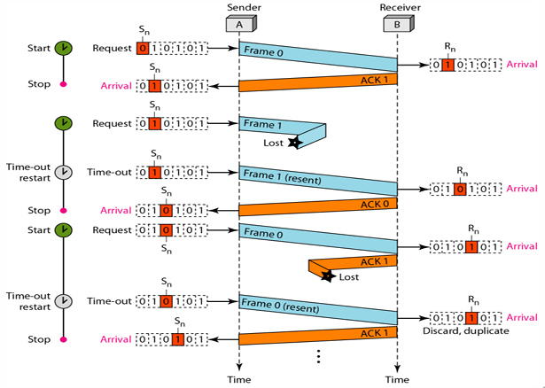
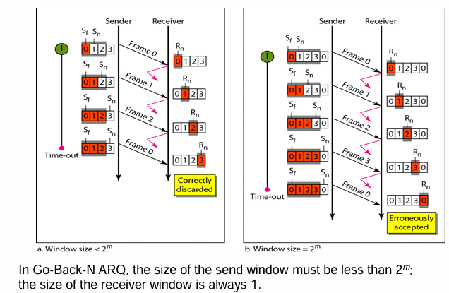

# FLOW CONTROL

To ensure that the sender doesn't overwhelm the receiver by sending data faster than it can process.

Techniques Used:
1. Stop and Wait
2. Sliding Window
   - Go Back N
   - Selective Repeat ARQ

---

## <center> 1. Stop-and-Wait Protocol
- Sender sends a data frame to the receiver.
- Sender waits until it receives an ACK.
- If ACK is received, sender sends the next frame.
- If ACK is not received within a timeout period:
  - The sender resends the same frame (assuming it was lost or corrupted).
- Receiver sends an ACK after correctly receiving a frame

Only 1-bit sequence number (0 and 1) is used, as window size of both s and r is one


## <center>2. Sliding Window Protocol
Sender can send multiple frames (within window size) without waiting for ACKs.

---


### 1. **Go-Back-N:**  
- Go-Back-N ARQ is a sliding window protocol used to send N frames (called window size) at once.  
- But if any one frame is lost or damaged, the receiver discards all subsequent frames, and the sender has to go back and resend from the error frame onward.
- Cumulative ACK is used: ACK n means all frames up to n are received correctly.

```math
Sender Window size : 2^m - 1
```
m = number of bits used for the sequence number field

Window size should always be less than 2^m - 1  
Because if window size = 2^m, ambiguity arises. The receiver may not be able to differentiate between:
- a new frame (after wraparound) and
- an old frame (that was resent or delayed).




### 2. **Selective Repeat:**  
Only the wrong frame is retransmitted, not the whole window.

```math
Sender Window size : 2^m - 1 

Receiver Window size : 2^m - 1
```