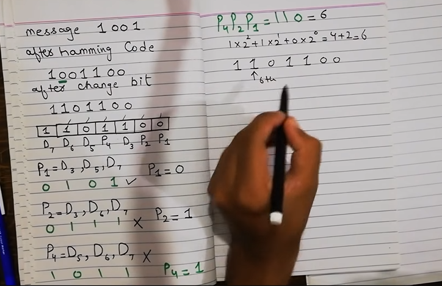

# 
 ERROR CONTROL

TYPES OF ERROR
- Single Bit Error
- Burst Error

ERROR DETECTION
- Parity Bit Checker
- CheckSum

- CRC
  - Max can find power no of burst errors
  - Total Redundant bits = power

---
ERROR CORRECTION
- Hamming Code
- 