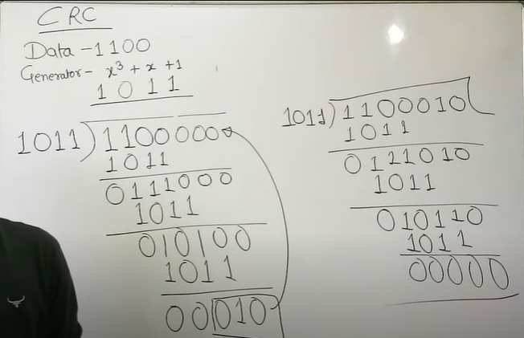
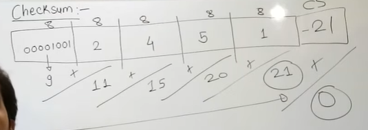

# 
 ERROR CONTROL

TYPES OF ERROR
- Single Bit Error
- Burst Error

ERROR DETECTION
- Parity Bit Checker
- CheckSum
- CRC

---
ERROR CORRECTION
- Hamming Code
- ARQ
  - Stop and wait
  - Go Back N
  - Selective Repeat

---
---

## CRC

## CHECKSUM
