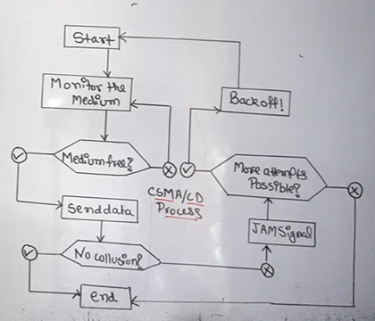

# Carrier Sense Multiple Access

CSMA is a media access control (MAC) protocol used in networks to avoid collisions when multiple devices try to send data on a shared medium.

CSMA works on two main ideas:

1. Carrier Sense 
→ A device first checks the channel to see if it is idle or busy.
2. Multiple Access  
→ Any device can try to access the medium, but must sense first.

| Type                                                | Description                                                                                                       |
| --------------------------------------------------- | ----------------------------------------------------------------------------------------------------------------- |
| **1. 1-Persistent CSMA**                            | If channel is idle → transmit immediately. If busy → keep sensing and transmit **as soon as** it becomes idle. |
| **2. Non-Persistent CSMA**                          | If channel is busy → **wait random time** before sensing again. Less chance of collision.                         |
| **3. p-Persistent CSMA** (used in slotted channels) | If channel is idle → transmit with probability **p**, wait with probability **1-p** in the next slot.             |

---
Even with sensing, collisions can still occur, especially in the case of propagation delay — two devices might sense the channel as idle at the same time.

## CSMA/CD
Carrier Sense Multiple Access with Collision Detection  
Used in: Wired networks like Ethernet

1. Sense the channel: If idle → transmit.
2. While transmitting, monitor the medium to detect any collision.
3. If collision detected →
   - Stop transmission immediately.
   - Send jam signal to notify other devices.
   - Wait random backoff time (based on exponential backoff algorithm).
   - Try again.

## CSMA/CA
Carrier Sense Multiple Access with Collision Avoidance
1. Sense the channel:
   - If idle → wait for a short time (Inter-Frame Space, IFS).
   - Then start transmission.

2. If busy → wait for random backoff time, then try again.
3. Optional: Use RTS/CTS (Request to Send / Clear to Send) mechanism to further reduce collision chance.

Collision detection is difficult in wireless due to weak signal and hidden node problem. So better to avoid collision.

Wi-Fi (IEEE 802.11)
