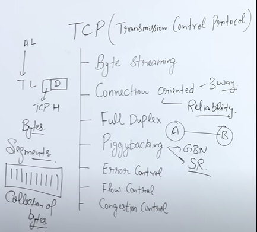
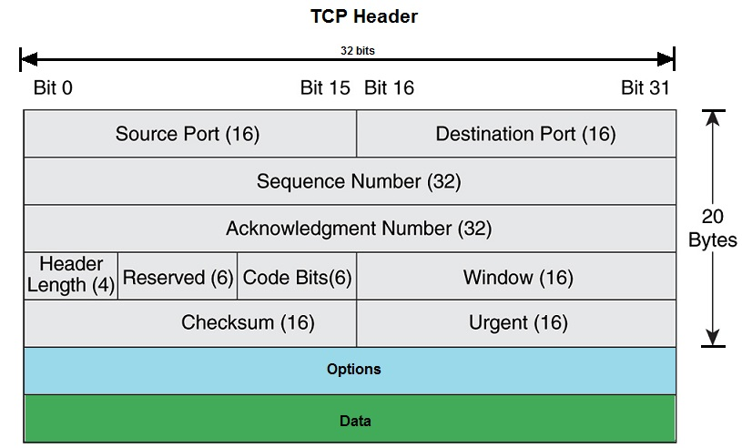

# TRANSPORT LAYER

---
PROTOCOLS USED - TCP & UDP

# 
 TCP HEADER

Size : 20-60 Bytes

1. **Source & Destination Port**  
(16 bits each) => 2^16 Possible ports, **Range** : 0 to 65535  
**0 - 1023** : Well known  
**1024 - 49151** : Registered Port nos. by IANA  
**49152 - 65535** : Dynamic / private
2. **Sequence Number**  
No. given to each byte, Randomly
3. **Acknowledgement Number**  
4. **Header Length** (4 bits)  
0000 - 1111 i.e. 0 to 15, we scale by 4 => as 20-60 range
Hence : Possible Hlen (0101 to 1111) 5 to 15
5. **Reserved Bits** (6 Bits)
6. **Flags** 
7. **Windows** (16)  
Receiving winodow size
8. **CheckSum** (16)
For error control
9. **Urgent** (16)   
Tells range of data i.e. important
10. **Options**  
To send extra data