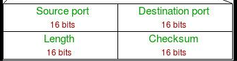

# UDP
Connectionless, Unreliable, No Ordering

---
| Field                | Size (bits) | Description                                                   |
| -------------------- | ----------- | ------------------------------------------------------------- |
| **Source Port**      | 16          | Port of the sender (optional for some clients)                |
| **Destination Port** | 16          | Port of the receiver (mandatory)                              |
| **Length**           | 16          | Total length of UDP header + data (in bytes)                  |
| **Checksum**         | 16          | Used for error-checking (optional in IPv4, mandatory in IPv6) |

---
Min Size : 2+2+2+2 : 8Bytes
UDP Length : 2^16=65535Bytes

---

Why UDP Better the TCP IP ?
1. Less Overhead
2. Query Respone Protocol(One request one reply), DNS
3. Speed
4. BroadCasting/Multicasting (RIP), connection with everyone
5. Continuous Streaming