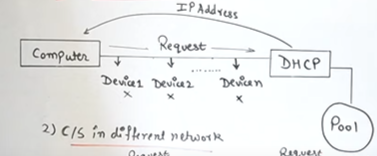

# DHCP
Dynamic Host Configuration Protocol

Sitaution 1 : Client Server in same network

Situation 2 : Client Server in differentt network

Need of DHCP ?
Can't assign IPs manually.  
Prevents same addresses.  
Keeps track  
Reclaims unused and reassigns