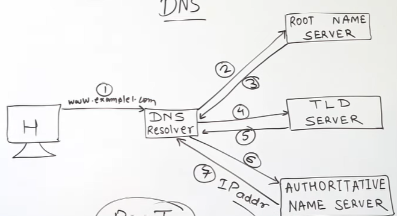
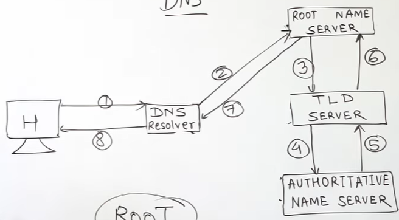

# DNS

Domain name System  
Translates domain names into their corresponding IP Addresses

HOW ?
You searched something like www.example.com
1. Browser first checks it's local cache
2. If not found, query sent to DNS resolver
3. Again if not found, resolver contacts
   1. Root DNS Server (.com, .in) knows where to find TLD
   2. TLD Server (example.xom) knows where to find Authoriatative
   3. Authoritative Server : Final mapping is done

Iterative -  

Recurssive -  
