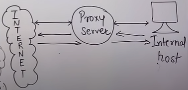

# FIREWALL

A Firewall is a security system (hardware or software) that monitors and controls incoming and outgoing network traffic based on predefined security rules.

To act as a barrier between a trusted internal network (like your computer or office network) and an untrusted external network (like the Internet).

## 1. Packet-Filter Firewall
Controls access to a network by analyzing individual packets and filtering them based on predefined rules like:
- Source IP address
- Destination IP address
- Port number
- Protocol

Data/payload is not checked

## 2. Proxy Firewall
It hides the internal network and filters traffic at the application layer.  
More Secure  
Checks data too  
1. Client sends request to proxy
2. Proxy checks the request, applies rules
3. If allowed, proxy forwards request to destination
4. Server responds to proxy → proxy responds to client

